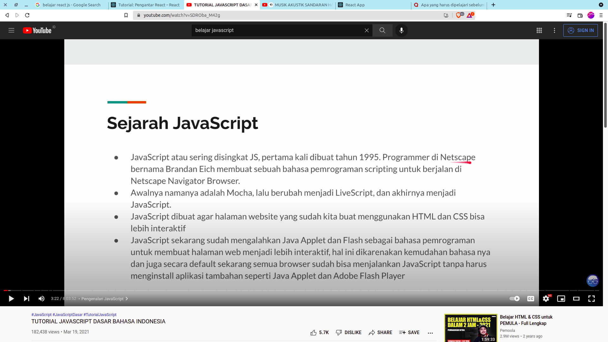
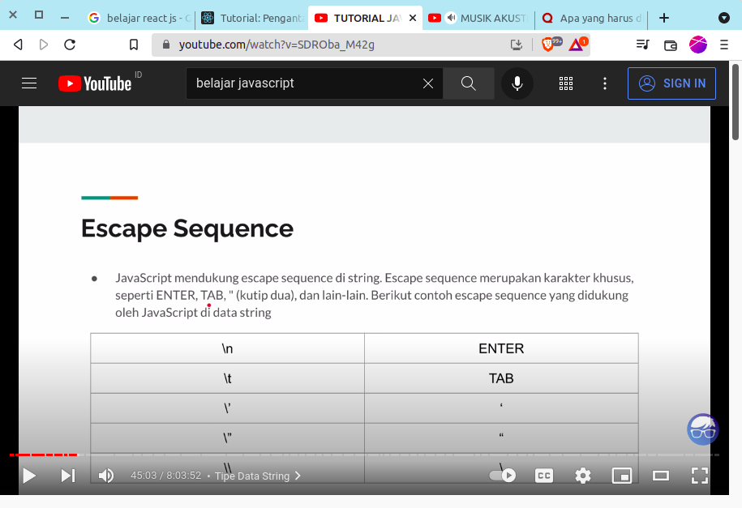
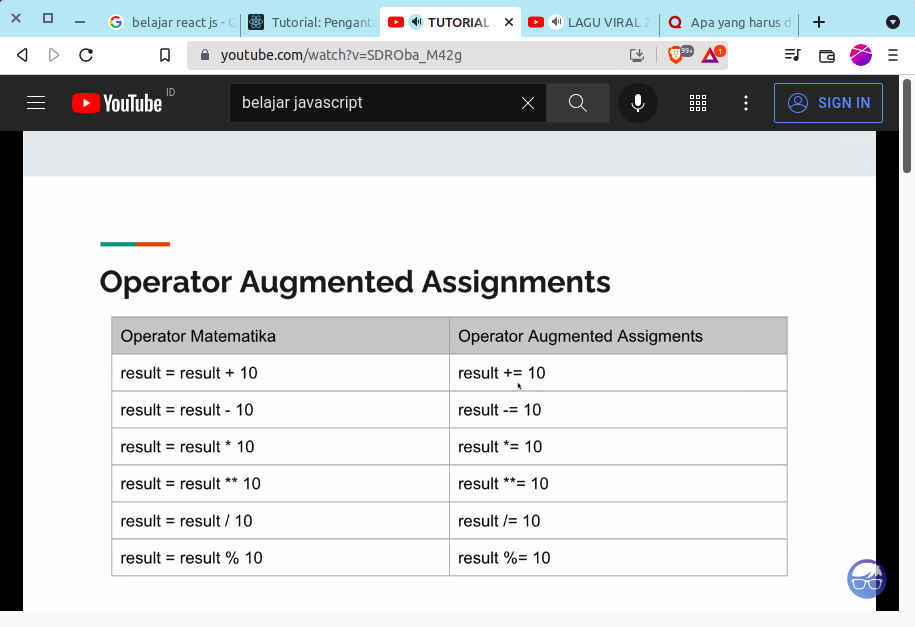
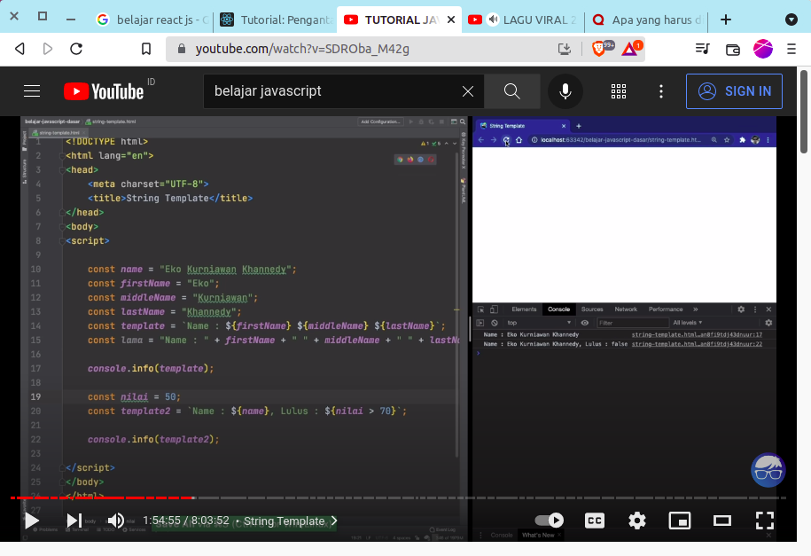

Ahmadi Resolusi
- Belajar Git/Github
  - link : https://github.com/ahmadiaon/resolusi_/blob/github/github.txt
- Belajar Figma
  link : 
  - https://github.com/ahmadiaon/resolusi_/blob/figma/figma.txt
  - https://www.figma.com/community/file/812721945562507554
  - https://www.figma.com/file/xWtnVLqItUvfaoi1jgaNkp/Favicon-%26-Browser-Mockup-(Community)?node-id=1%3A2
- Belajar CI 4
- Belajar Javascript
  - sejarah 
    -
  - komentar 
    - //  | /* */
  - tipe data number
    -cuma 1 number 
  - boolean
    - true | false
  - String
    - tambah String menggunakan + "aa" + "aaa"
    - 
  - var diganti dengan 
    - let
    - const
    - 
  - console
    - console.info()
    - console.warn()
    - console.error()
    - console.table()
  - strig operasi 
    - 
  - in operator === cek ada tidak variabel atau atribut atau propertis 
  - nullish data = parameter ?? "nilai default"
  - Optional chaining mengamankan nullish 
    - 
  - falsy merubah ke boolean, 
  - truthy 
